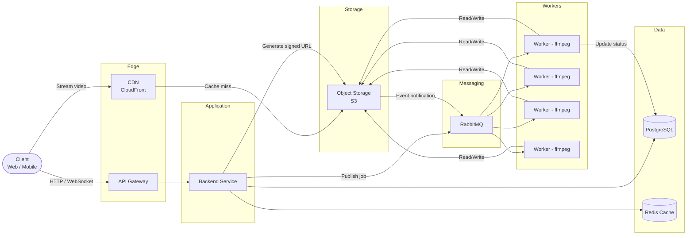
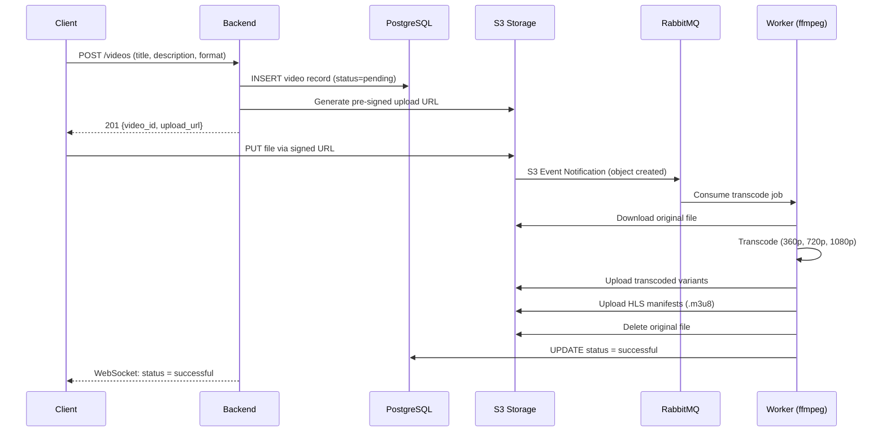
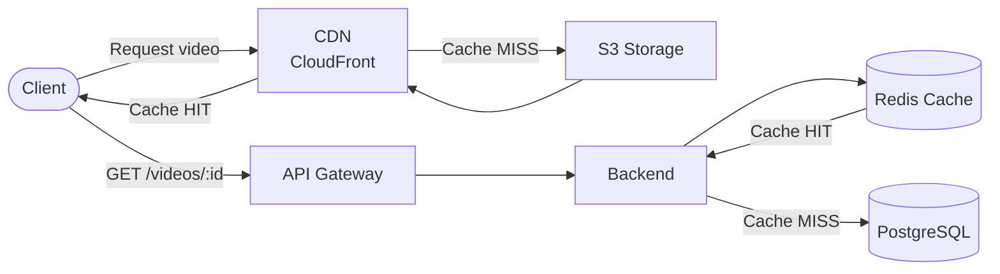
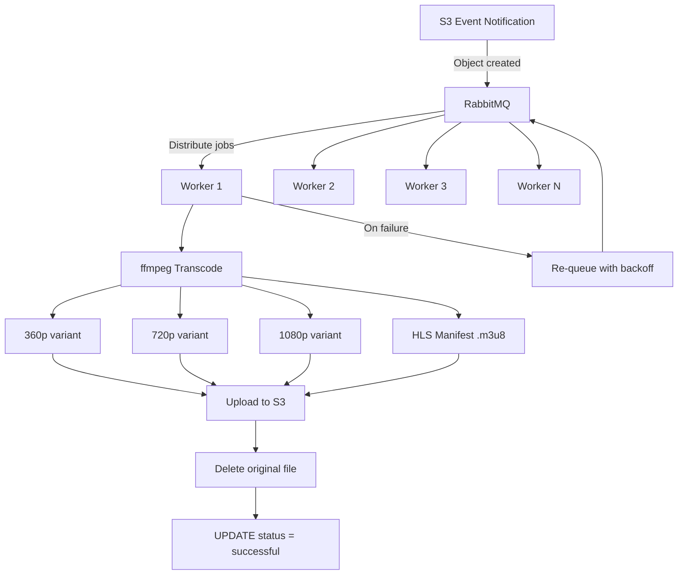

# Video Platform System Design

System design for a scalable video upload, transcoding, and streaming platform — similar to YouTube. Originally prepared as a system design interview exercise.

## Problem Statement

Design a video platform that allows users to:

- **Upload** videos of arbitrary size and format
- **Transcode** videos into multiple resolutions and standard formats for playback
- **Stream** videos to a large number of concurrent viewers with low latency
- **Manage** video metadata (title, description, access control, status tracking)

### Key Requirements

| Category | Requirement |
|----------|-------------|
| **Functional** | Users can upload videos via a web/mobile client |
| | Videos are transcoded into multiple resolutions (360p, 480p, 720p, 1080p) |
| | Videos are served via adaptive bitrate streaming (HLS/DASH) |
| | Users can set video access to public or private |
| | Users receive real-time status updates on upload/transcode progress |
| **Non-Functional** | Upload should handle large files (multi-GB) without backend bottleneck |
| | Transcoding must be horizontally scalable |
| | Video playback must have low latency globally (CDN) |
| | System must be fault-tolerant (failed transcodes are retried) |

### Back-of-the-Envelope Estimates

| Metric | Estimate |
|--------|----------|
| DAU | 10M |
| Uploads per day | 100K |
| Average video size | 500 MB |
| Daily ingress | ~50 TB |
| Read:Write ratio | ~100:1 |
| Peak concurrent viewers | ~1M |

---

## Architecture Overview



---

## Detailed Design

### 1. Video Upload Flow

The upload path is designed so that **large video files never pass through the backend**. Instead, the client uploads directly to object storage using a pre-signed URL.



**Key decisions:**

- **Pre-signed URLs** — the client uploads directly to S3, avoiding a backend bottleneck for large files
- **S3 event notifications** — triggers transcoding immediately when the upload completes (no polling delay)
- **WebSocket** — real-time status push to the client (no need to poll for transcode completion)

### 2. Video Streaming / Read Path

This is the **highest traffic path** (~100:1 read-to-write ratio) and must be optimized for latency and throughput.



**How it works:**

1. Client requests video metadata from the API (`GET /videos/:id`)
2. Backend checks **Redis** first for cached metadata; falls back to PostgreSQL
3. Response includes the CDN URL for the HLS manifest (`.m3u8`)
4. Client video player fetches the `.m3u8` manifest from the **CDN**
5. Player uses **adaptive bitrate streaming** — automatically switches between 360p/720p/1080p based on network conditions
6. CDN caches video segments at edge locations worldwide for low-latency delivery

### 3. Transcoding Pipeline



**Design considerations:**

- Workers are **stateless** and horizontally scalable — add more to handle upload spikes
- Each worker: downloads the original, runs ffmpeg to produce multiple resolutions, uploads the variants, removes the original
- **Retry with backoff** — failed jobs are re-queued with exponential backoff (max 3 retries before marking as `failed`)
- **Dead letter queue** — permanently failed jobs go to a DLQ for manual inspection
- Output format: **HLS** (`.m3u8` manifest + `.ts` segments) for adaptive bitrate streaming

### 4. Data Model

```sql
CREATE TABLE users (
    id          UUID PRIMARY KEY DEFAULT gen_random_uuid(),
    username    VARCHAR(50) UNIQUE NOT NULL,
    email       VARCHAR(255) UNIQUE NOT NULL,
    created_at  TIMESTAMP DEFAULT now()
);

CREATE TABLE videos (
    id          UUID PRIMARY KEY DEFAULT gen_random_uuid(),
    user_id     UUID REFERENCES users(id),
    title       VARCHAR(255),
    description TEXT,
    status      VARCHAR(20) DEFAULT 'pending',  -- pending | processing | successful | failed
    access      VARCHAR(20) DEFAULT 'private',   -- private | public
    duration    INTEGER,                          -- seconds, populated after transcode
    thumbnail   VARCHAR(512),                     -- S3 URL, generated during transcode
    s3_key      VARCHAR(512) NOT NULL,            -- base S3 key (variants derived from this)
    created_at  TIMESTAMP DEFAULT now(),
    updated_at  TIMESTAMP DEFAULT now()
);

CREATE INDEX idx_videos_user_id ON videos(user_id);
CREATE INDEX idx_videos_status ON videos(status);
CREATE INDEX idx_videos_created_at ON videos(created_at DESC);
```

### 5. API Endpoints

| Method | Endpoint | Description |
|--------|----------|-------------|
| `POST` | `/videos` | Request upload — returns signed URL and video ID |
| `GET` | `/videos/:id` | Get video metadata and streaming URL |
| `GET` | `/videos?user_id=X` | List user's videos |
| `PATCH` | `/videos/:id` | Update title, description, access |
| `DELETE` | `/videos/:id` | Soft-delete a video |
| `GET` | `/ws/videos/:id/status` | WebSocket for real-time transcode status |

### 6. Consistency Reconciliation

A background **cron job** runs periodically to handle edge cases:

- **Stale pending records** — videos stuck in `pending` for >1 hour (signed URL expired, client never uploaded) are cleaned up
- **Orphaned S3 objects** — S3 objects with no matching database record are flagged for deletion
- **Stuck processing** — videos in `processing` for >30 minutes are re-queued

This acts as a **safety net**, not the primary mechanism.

---

## Scaling Considerations

| Component | Strategy |
|-----------|----------|
| **Backend** | Stateless, horizontally scaled behind API Gateway / load balancer |
| **PostgreSQL** | Read replicas for query-heavy read path; partition videos table by `created_at` for large datasets |
| **Redis** | Cache hot video metadata, user sessions; reduces DB read load |
| **S3** | Virtually unlimited storage; use S3 lifecycle policies to move old/cold videos to cheaper tiers (Glacier) |
| **CDN** | Edge caching for video segments; absorbs ~95% of read traffic |
| **Workers** | Auto-scale based on RabbitMQ queue depth; spot/preemptible instances to reduce cost |
| **RabbitMQ** | Clustered for HA; monitor queue depth for backpressure signals |

---

## Potential Extensions

- **Search & Discovery** — Elasticsearch for full-text search on titles/descriptions; recommendation engine for feed
- **Thumbnails** — Auto-generate during transcode (extract frame at 25% of duration)
- **Analytics** — Separate view-count service (high write throughput) using Kafka + ClickHouse
- **Comments & Social** — Separate microservice with its own datastore
- **Live Streaming** — RTMP ingest + real-time transcoding (significantly different pipeline)

---

## Architecture Diagram

The full interactive diagram is available in [`design.excalidraw`](design.excalidraw) — open it at [excalidraw.com](https://excalidraw.com) to view and edit.
